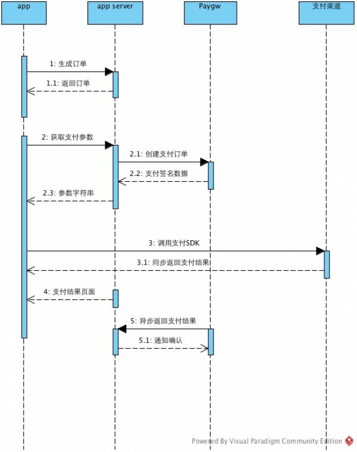

# Camera360 Paygw Server SDK For PHP
PGWireless Paygw Server SDK Library For PHP


## 目录

1. [需求背景](#需求背景)
1. [安装INSTALL SDK](#安装install-sdk)
   * [编辑composer.json安装](#编辑composerjson安装)
   * [直接composer require](#直接composer-require)
1. [SDK快速开始](#sdk快速开始)
   * [创建支付订单示例](#创建支付订单示例)
   * [查询订单支付状态示例](#查询订单支付状态示例)
   * [订单退款示例](#订单退款示例)
   * [处理支付异步通知示例](#处理支付异步通知示例)
   * [处理退款异步通知示例](#处理退款异步通知示例)
1. [Camera360支付中心流程](#camera360支付中心流程)
1. [系统交互](#系统交互)
   * [协议](#协议)
   * [数据格式](#数据格式)
   * [签名](#签名)
   * [协议](#协议)
1. [生成公私钥](#生成公私钥)
   * [安装openssl](#安装openssl)
   * [生成RSA私钥](#生成rsa私钥)
   * [生成RSA公钥](#生成rsa公钥)
1. [PHP语言签名示例代码](#php语言签名示例代码)
1. [支付渠道配置](#支付渠道配置)
   * [支付宝钱包](#支付宝钱包)
   * [微信钱包](#微信钱包)
   * [支付宝wap支付](#支付宝wap支付)
   * [微信公众号Native支付](#微信公众号native支付)
   * [paypal](#paypal)
   * [MOLPoints](#molpoints)
   * [PAYSBUY](#paysbuy)
   * [2c2p](#2c2p)
1. [Camera360支付中心API](#camera360支付中心api)
   * [支付方式（way）](#支付方式way)
   * [货币类型（currency）](#货币类型currency)
   * [商户（biz_id）](#商户biz_id)
   * [支付订单状态（trade_status）](#支付订单状态trade_status)
   * [退款订单状态（refund_status）](#退款订单状态refund_status)
   * [创建支付订单](#创建支付订单)
   * [支付异步通知](#支付异步通知)
   * [退款](#退款)
   * [退款异步通知](#退款异步通知)
   * [查询订单支付情况](#查询订单支付情况)
   * [支付接口返回示例](#支付接口返回示例)


## 需求背景

由于全平台的产品线丰富，各应用都有支付的需求，而支付涉及一系列敏感密钥和流程，如支付宝、微信密钥key，支付创建订单、退款、查询订单、转账、对账、财务统计等。为了统一管理支付的所有密钥，节约其他应用程序开发时间及成本，有必要在平台内建立和完善支付网关或者支付中心应用。

## 安装INSTALL SDK

### 编辑composer.json安装

```javascript
    {
        "name": "项目名",
        "description": "项目描述",
        "keywords": [
            "paygw"
        ],
        "homepage": "your homepage",
        "type": "project",
        "license": "BSD-3-Clause",
        "minimum-stability": "stable",
        "repositories": {
            "0": {
                "type": "vcs",
                "url": "https://github.com/PGWireless/php-paygw-server-sdk"
            },
            "packagist": {
                "type": "composer",
                "url": "https://packagist.phpcomposer.com"
            }
        },
        "require": {
            "php": ">=5.4.0",
            "PGWireless/php-paygw-server-sdk": ">=1.0.3"
        }
        // ...
    }
```

### 直接composer require

    composer require "PGWireless/php-paygw-server-sdk:*"

## SDK快速开始

### 创建支付订单示例

```php
<?php
$pay = new \PG\paySDK\Pay(12, 'sandbox', 'RSA私钥');
$payLoad = [
    'biz_id'        => 1, // 商户ID
    'way'           => 101, // 支付方式
    'currency'      => 'CNY', // 货币类型
    'out_trade_no'  => '2016052523310222327', // 商户订单号
    'subject'       => 'Camera360商城订单', // 订单标题
    'body'          => '超级可爱的大白', // 订单正文
    'total_fee'     => 99900, // 总共的费用
    'expire_second' => 3600, // 支付的有效时间
    'user_id'       => '2323232', // 用户ID,可自定义,但不能为空
    'user_name'     => '长风', // 用户名,可自定义,但不能为空
    'client_ip'     => '129.33.56.21', // 用户支付的IP
];

var_dump($pay->create($payLoad));
```

输出:

    array(2) {
      ["sdk"]=>
      array(1) {
        ["order_info"]=>
        string(567) "_input_charset="utf-8"&body="超级可爱的大白"&it_b_pay="60m"&notify_url="https%3A%2F%2Fpaygw-qa.camera360.com%2Fapi%2Fnotify%2Falipay-app-sdk-pay-async-callback"&out_trade_no="pp_12_2016052523310222327"&partner="xxx"&payment_type="1"&seller_id="xxx"&service="mobile.securitypay.pay"&subject="Camera360商城订单"&total_fee="999.00"&sign="m2FPk16N4ZKyYyes65IFOt9cInYjR6IoN3GRLUhIYk6PmM0djmI63i1HGt0ICyVyKAnEQhx%2FBaTFeTL7%2FE6bNqvLAXvGYLYm49gEpl0VKLpW8NZft7CacfGrxYoiwoEEOBBJ94zL112Fn0SfIHZSUqPSttx0yPNdqfAPXeaaYZo%3D"&sign_type="RSA""
      }
      ["trade"]=>
      array(10) {
        ["out_trade_no"]=>
        string(19) "2016052523310222327"
        ["way"]=>
        string(3) "101"
        ["total_fee"]=>
        int(99900)
        ["subject"]=>
        string(21) "Camera360商城订单"
        ["body"]=>
        string(21) "超级可爱的大白"
        ["expire_second"]=>
        int(3600)
        ["currency"]=>
        string(3) "CNY"
        ["create_time"]=>
        string(19) "2016-05-26 00:47:21"
        ["pp_sign"]=>
        string(172) "t7SrQJkMu87Ws33ebgEzQ/g5Bg+zkRff5fCvbF4lFIx9y2Ux4ukbYeXzAzUGnaR5r3dETOInbiGOOkvO8V7F5lVBsx9yYNS6wzteMe+vY0PfvcYNIs9ENlVS5VbZEFTajSUqeZs9EYqG8431BiNz8az767R+8LAogq2Fvcr5ZIg="
        ["pp_sign_type"]=>
        string(3) "RSA"
      }
    }

### 查询订单支付状态示例

```php
<?php
    $pay = new \PG\paySDK\Pay(12, 'sandbox', 'RSA私钥');
    $payLoad = [
        'way'           => 201, // 支付方式
        'out_trade_no'  => '20160406145992887952699803', // 商户订单号
    ];

    var_dump($pay->query($payLoad));
```

输出:

    array(10) {
      ["trade_status"]=>
      int(201)
      ["refund_status"]=>
      int(801)
      ["way"]=>
      int(201)
      ["biz_id"]=>
      string(2) "12"
      ["out_trade_no"]=>
      string(26) "20160406145992887952699803"
      ["trade_no"]=>
      string(28) "4009662001201604064597093541"
      ["total_fee"]=>
      string(1) "1"
      ["currency"]=>
      string(3) "CNY"
      ["pp_sign"]=>
      string(172) "FfzJugWOuRmZGNQKo3ervbA7yKbjuTZUYlS+6zn7WM+B5SPdNh1R4Nqjj+i1kpQ+oa+m5TOEGjnxqjkcJYD3Ou7r2E+UjdlnrxwhyXpBZFWWmR4VoQ82Zi0wIKQMkzx7CMGDhViVISp4Vhjl5fXJW3E7yAH0q/XJSgzNGyVDavs="
      ["pp_sign_type"]=>
      string(3) "RSA"
    }

### 订单退款示例

```php
<?php
    $refund = new \PG\paySDK\Refund(12, 'sandbox', 'RSA私钥');
    $post = [
        'way'           => '101',
        'out_trade_no'  => '20160406145992887952699803',
        'out_refund_no' => '30160406145992887952699804',
        'reason'        => '颜色款式不喜欢',
        'total_fee'     => 100,
        'refund_fee'    => 80,
        'user_id'       => '2323232',
        'user_name'     => '长风',
    ];

    $refundParams = $refund->create($post);
    var_dump($refundParams);
```

### 处理支付异步通知示例

```php
<?php
    $notify = new \PG\paySDK\Notify(12, 'sandbox', 'RSA私钥');
    $notify->setNotifyMessage($_POST);
    var_dump($notify->isPaySuccess());
```

### 处理退款异步通知示例

```php
<?php
    $notify = new \PG\paySDK\Notify(12, 'sandbox', 'RSA私钥');
    $notify->setNotifyMessage($_POST);
    var_dump($notify->isRefundSuccess());
```

## Camera360支付中心流程



## 系统交互

### 协议

HTTPS POST

### 数据格式

JSON

### 签名

#### 待签名数据集

待签名数据集是一个键值对集合

#### 待签名字符串生成方式

由待签名数据集的键值对，按照key=value的形式拼接，然后按照字母序排序成一个字符串数组，用字符'&'来连接这个数组，得到的字符串作为待签名字符串。

#### RSA签名方式

签名方式：得到待签名字符串后，用私钥签名，得到的结果就是签名结果。

验签方式：得到待签名字符串后，用公钥验证给出的签名是否正确。

#### 签名使用

|应用场景|签名方|验签方|签名方式|待签名数据集|验证结果|签名数据|验签数据|
|---|---|---|---|---|---|---|---|
|api/pay/create请求参数防伪|其他应用|paygw|RSA|请求的POST参数中除pp_sign和pp_sign_type之外的所有参数|pp_sign|其他应用私钥|其他应用公钥|
|api/pay/create返回参数防伪|paygw|其他应用|RSA|返回数据中除pp_sign和pp_sign_type之外的所有参数|pp_sign|paygw支付私钥|paygw支付公钥|
|api/pay/query请求参数防伪|其他应用|paygw|RSA|请求的POST参数中除pp_sign和pp_sign_type之外的所有参数|pp_sign|其他应用私钥|其他应用公钥|
|api/pay/query返回参数防伪|paygw|其他应用|RSA|返回数据中除pp_sign和pp_sign_type之外的所有参数|pp_sign|paygw支付私钥|paygw支付公钥|
|api/refund/create请求参数防伪|其他应用|paygw|RSA|请求的POST参数中除pp_sign和pp_sign_type之外的所有参数|pp_sign|其他应用私钥|其他应用公钥|
|api/refund/create返回参数防伪|paygw|其他应用|RSA|返回数据中除pp_sign和pp_sign_type之外的所有参数|pp_sign|paygw支付私钥|paygw支付公钥|
|api/pay/notify返回参数防伪|paygw|其他应用|RSA|返回数据中除pp_sign和pp_sign_type之外的所有参数|pp_sign|paygw支付私钥|paygw支付公钥|

#### Paygw公钥

    -----BEGIN PUBLIC KEY-----
    MIGfMA0GCSqGSIb3DQEBAQUAA4GNADCBiQKBgQDgJqx9mv2y4N0hEFHSnke/VavI
    sLndZRQxNedjIs+VP5k5XQNyqvRaZBGPgw/xolWmKd1+htlwuiJ3mNRUuJAURbFN
    DOONqlWXtDa7Uzf5G4dRqa+ZhUOofb4mGF/aR4ucyXVY4IXm6+cmDbrTxoeyc71a
    8AbcCDGLtH/suXOykwIDAQAB
    -----END PUBLIC KEY-----

## 生成公私钥

### 安装openssl

### 生成RSA私钥

    $ genrsa -out rsa_private_key.pem 1024

### 生成RSA公钥

    $ rsa -in rsa_private_key.pem -pubout -out rsa_public_key.pem

## PHP语言签名示例代码

```php
<?php
    /**
     * 验证RSA签名（防伪）
     *
     * @param array $data 请求传递的数据
     * @param string $paygwPublicKey Camera360支付网关公钥
     * @return boolean
     */
    function verifyRSASign(array $data, $paygwPublicKey)
    {
        if (empty($data['pp_sign'])) {
            return 0;
        }

        $sign = $data['pp_sign'];
        unset($data['pp_sign']);
        unset($data['pp_sign_type']);
        ksort($data);

        $message = '';
        foreach ($data as $key => $value) {
            $message .= $key . '=' . $value . '&';
        }
        $message     = substr($message, 0, -1);
        $publicKeyId = openssl_pkey_get_public($paygwPublicKey);
        $result      = openssl_verify($message, base64_decode($sign), $publicKeyId);
        openssl_free_key($publicKeyId);

        return $result;
    }

    /**
     * RSA签名数据
     *
     * @param array $data 待签名数据
     * @param string $bizPrivateKey 商户公钥
     * @return string
     */
    function RSASign(array $data, $bizPrivateKey)
    {
        ksort($data);

        $message = '';
        foreach ($data as $key => $value) {
            $message .= $key . '=' . $value . '&';
        }

        $message      = substr($message, 0, -1);
        $privateKeyId = openssl_pkey_get_private($bizPrivateKey);
        $signature    = '';
        openssl_sign($message, $signature, $privateKeyId);
        openssl_free_key($privateKeyId);

        return base64_encode($signature);
    }
```

## 支付渠道配置

### 支付宝钱包

```javascript
    {
        // 支付服务标识
        "service": "mobile.securitypay.pay",
        // 退款服务标识
        "refund_service": "refund_fastpay_by_platform_nopwd",
        // 查询服务标识
        "query_service": "single_trade_query",
        // 数据编码
        "input_charset": "utf-8",
        // 支付类型
        "payment_type": 1,
        // partner ID
        "partner": "xxx",
        // 收款账号名
        "account_name": "Camera360",
        // 商家ID，可和partner相同
        "seller_id": "xxx",
        // key
        "key": "xxx",
        // 退款成功异步通知地址
        "refund_notify_url": "/api/notify/alipay-app-sdk-refund-async-callback",
        // 支付成功异步通知地址
        "notify_url": "/api/notify/alipay-app-sdk-pay-async-callback",
        // 异步通知校验地址
        "notify_verify_url": "https://mapi.alipay.com/gateway.do?service=notify_verify&",
        // 异步通知检验超时时间
        "notify_verify_timeout": 10,
        // 支付成功异步通知商户地址
        "biz_notify_pay_url": "https://mall-dev.camera360.com/v3/notify/payAsyncNotify",
        // 支付成功异步通知商户超时时间
        "biz_notify_pay_timeout": 10,
        // 退款成功异步通知商户地址
        "biz_notify_refund_url": "https://mall-dev.camera360.com/v3/notify/refundAsyncNotify",
        // 退款成功异步通知商户超时时间
        "biz_notify_refund_timeout": 10,
        // 转账成功异步通知商户地址
        "biz_notify_transfer_url": "https://mall-dev.camera360.com/v3/notify/transferAsyncNotify",
        // 转账成功异步通知商户超时时间
        "biz_notify_transfer_timeout": 10,
        // 商户私钥（和支付宝通信）
        "rsa_private_key": "xxx",
        // 商户公钥（和支付宝通信）
        "rsa_public_key": "xxx"
    }
```

### 微信钱包

```javascript
    {
        // 微信应用ID
        "appid": "xxx",
        // 商户ID
        "mch_id": "xxx",
        // 交易终端类型
        "trade_type": "APP",
        // key
        "partnerKey": "xxx",
        // 支付成功异步通知回调地址
        "notify_url": "/api/notify/weichat-app-sdk-pay-async-callback",
        // 支付成功异步通知商户回调地址
        "biz_notify_pay_url": "https://paygw.camera360.com/demo/notify/pay",
        // 支付成功异步通知商户超时时间
        "biz_notify_pay_timeout": 10,
        // 退款成功异步通知商户回调地址
        "biz_notify_refund_url": "https://paygw.camera360.com/demo/notify/refund",
        // 退款成功异步通知商户超时时间
        "biz_notify_refund_timeout": 10,
        // 转账成功异步通知商户回调地址
        "biz_notify_transfer_url": "https://paygw.camera360.com/demo/notify/transfer",
        // 转账成功异步通知商户超时时间
        "biz_notify_transfer_timeout": 10,
        // ssl cert字符串
        "sslcert": "xxx",
        // ssl key字符串
        "sslkey": "xxx",
        // ssl cert证书文件路径，可以为空，注意保持唯一性
        "sslcertPath": "/home/worker/data/www/runtime/paygw/xxx_cert.pem",
        // ssl key证书密钥文件路径，可以为空，注意保持唯一性
        "sslkeypath": "/home/worker/data/www/runtime/paygw/xxx_key.pem",
        // 证书更新时间
        "sslcertpathUpdateTime": 1447318251,
        // 证书key更新时间
        "sslkeypathUpdateTime": 1447318251
    }
```

### 支付宝wap支付

```javascript
    {
        // 支付服务标识
        "service": "alipay.wap.create.direct.pay.by.user",
        // 退款服务标识
        "refund_service": "refund_fastpay_by_platform_nopwd",
        // 查询服务标识
        "query_service": "single_trade_query",
        // 数据编码
        "input_charset": "utf-8",
        // 支付类型
        "payment_type": 1,
        // partner ID
        "partner": "xxx",
        // 收款账号名
        "account_name": "Camera360",
        // 商家ID，可和partner相同
        "seller_id": "xxx",
        // key
        "key": "xxx",
        // 退款成功异步通知地址
        "refund_notify_url": "/api/notify/alipay-app-sdk-refund-async-callback",
        // 支付成功异步通知地址
        "notify_url": "/api/notify/alipay-app-sdk-pay-async-callback",
        // 异步通知校验地址
        "notify_verify_url": "https://mapi.alipay.com/gateway.do?service=notify_verify&",
        // 异步通知检验超时时间
        "notify_verify_timeout": 10,
        // 支付成功异步通知商户地址
        "biz_notify_pay_url": "https://mall-dev.camera360.com/v3/notify/payAsyncNotify",
        // 支付成功异步通知商户超时时间
        "biz_notify_pay_timeout": 10,
        // 退款成功异步通知商户地址
        "biz_notify_refund_url": "https://mall-dev.camera360.com/v3/notify/refundAsyncNotify",
        // 退款成功异步通知商户超时时间
        "biz_notify_refund_timeout": 10,
        // 转账成功异步通知商户地址
        "biz_notify_transfer_url": "https://mall-dev.camera360.com/v3/notify/transferAsyncNotify",
        // 转账成功异步通知商户超时时间
        "biz_notify_transfer_timeout": 10,
        // 商户私钥（和支付宝通信）
        "rsa_private_key": "xxx",
        // 商户公钥（和支付宝通信）
        "rsa_public_key": "xxx"
    }
```

### 微信公众号Native支付

```javascript
    {
        // 微信应用ID
        "appid": "xxx",
        // 商户ID
        "mch_id": "xxx",
        // 交易终端类型
        "trade_type": "JSAPI",
        // key
        "partnerKey": "xxx",
        // 支付成功异步通知回调地址
        "notify_url": "/api/notify/weichat-app-sdk-pay-async-callback",
        // 支付成功异步通知商户回调地址
        "biz_notify_pay_url": "https://paygw.camera360.com/demo/notify/pay",
        // 支付成功异步通知商户超时时间
        "biz_notify_pay_timeout": 10,
        // 退款成功异步通知商户回调地址
        "biz_notify_refund_url": "https://paygw.camera360.com/demo/notify/refund",
        // 退款成功异步通知商户超时时间
        "biz_notify_refund_timeout": 10,
        // 转账成功异步通知商户回调地址
        "biz_notify_transfer_url": "https://paygw.camera360.com/demo/notify/transfer",
        // 转账成功异步通知商户超时时间
        "biz_notify_transfer_timeout": 10,
        // ssl cert字符串
        "sslcert": "xxx",
        // ssl key字符串
        "sslkey": "xxx",
        // ssl cert证书文件路径，可以为空，注意保持唯一性
        "sslcertPath": "/home/worker/data/www/runtime/paygw/xxx_cert.pem",
        // ssl key证书密钥文件路径，可以为空，注意保持唯一性
        "sslkeypath": "/home/worker/data/www/runtime/paygw/xxx_key.pem",
        // 证书更新时间
        "sslcertpathUpdateTime": 1447318251,
        // 证书key更新时间
        "sslkeypathUpdateTime": 1447318251
    }
```

### Paypal

```
    {
        // Client ID
        "client_id": "xxx",
        // Secret
        "secret": "xxx",
        // 环境标识，sandbox为paypal仿真测试环境，live为上线环境
        "mode": "live",
        // paypal服务的支付方法
        "payment_method": "paypal",
        // 异步通知验证地址
        "notify_verify_url": "https://www.paypal.com/cgi-bin/webscr",
        // 异步通知验证请求的超时时间
        "notify_verify_timeout": 10,
        // 交易币种
        "currency": "USD",
        // 接收异步通知回调的地址
        "notify_url": "/api/notify/paypal-pay-async-callback",
        // 用户成功付款跳转地址
        "return_url": "/api/notify/paypal-payment-execution",
        // 用户取消付款跳转地址
        "cancel_url": "/api/notify/paypal-payment-execution",
        // 成功付款时跳转到商户的地址
        "biz_return_url": "https://paygw-qa.camera360.com/paygw/paySuccess.html",
        // 取消付款时跳转到商户的地址
        "biz_cancel_url": "https://paygw-qa.camera360.com/paygw/payFail.html",
        // 支付成功异步通知商户的地址
        "biz_notify_pay_url": "https://paygw-qa.camera360.com/demo/notify/pay",
        // 支付成功异步通知商户的超时时间
        "biz_notify_pay_timeout": 10,
        // 退款成功通知商户的地址
        "biz_notify_refund_url": "https://paygw-qa.camera360.com/demo/notify/refund",
        // 退款成功通知商户的超时时间
        "biz_notify_refund_timeout": 10,
        // 转账成功通知商户的地址
        "biz_notify_transfer_url": "https://paygw-qa.camera360.com/demo/notify/transfer",
        // 转账成功通知商户的超时时间
        "biz_notify_transfer_timeout": 10
    }
```

### MOLPoints

```javascript
    {
        // key
        "api_key": "d8504c29d81b0287",
        // secret
        "secret_key": "00485bwc6db6sce4f8bd84o522cf33dd",
        // 支付服务标识
        "pm_id": "molpoints",
        // 交易币种
        "currency": "USD",
        // 支付成功异步通知地址
        "notify_url": "/api/notify/payssion-pay-async-callback",
        // 支付失败的跳转链接
        "cancel_url": "/api/redirect/finally",
        // 支付成功的跳转链接
        "return_url": "/api/redirect/success",
        // 语言
        "language": "en",
        // 支付成功商户跳转地址
        "biz_return_url": "https://paygw-qa.camera360.com/paygw/paySuccess.html",
        // 支付失败商户跳转地址
        "biz_cancel_url": "https://paygw-qa.camera360.com/paygw/payFail.html",
        // 支付成功异步通知商户的地址
        "biz_notify_pay_url": "https://paygw-qa.camera360.com/demo/notify/pay",
        // 支付成功异步通知商户的超时时间
        "biz_notify_pay_timeout": 10,
        // 退款成功通知商户的地址
        "biz_notify_refund_url": "https://paygw-qa.camera360.com/demo/notify/refund",
        // 退款成功通知商户的超时时间
        "biz_notify_refund_timeout": 10,
        // 转账成功通知商户的地址
        "biz_notify_transfer_url": "https://paygw-qa.camera360.com/demo/notify/transfer",
        // 转账成功通知商户的超时时间
        "biz_notify_transfer_timeout": 10
    }
```

### PAYSBUY

```javascript
    {
        // key
        "api_key": "d8504c29d81b0287",
        // secret
        "secret_key": "0044215bwc6db6sce4f8bd84o522cf33dd",
        // 支付服务标识
        "pm_id": "paysbuy_th",
        // 交易币种
        "currency": "USD",
        // 支付成功异步通知地址
        "notify_url": "/api/notify/payssion-pay-async-callback",
        // 支付失败的跳转链接
        "cancel_url": "/api/redirect/finally",
        // 支付成功的跳转链接
        "return_url": "/api/redirect/success",
        // 语言
        "language": "en",
        // 支付成功商户跳转地址
        "biz_return_url": "https://paygw-qa.camera360.com/paygw/paySuccess.html",
        // 支付失败商户跳转地址
        "biz_cancel_url": "https://paygw-qa.camera360.com/paygw/payFail.html",
        // 支付成功异步通知商户的地址
        "biz_notify_pay_url": "https://paygw-qa.camera360.com/demo/notify/pay",
        // 支付成功异步通知商户的超时时间
        "biz_notify_pay_timeout": 10,
        // 退款成功通知商户的地址
        "biz_notify_refund_url": "https://paygw-qa.camera360.com/demo/notify/refund",
        // 退款成功通知商户的超时时间
        "biz_notify_refund_timeout": 10,
        // 转账成功通知商户的地址
        "biz_notify_transfer_url": "https://paygw-qa.camera360.com/demo/notify/transfer",
        // 转账成功通知商户的超时时间
        "biz_notify_transfer_timeout": 10
    }
```

### 2c2p

```javascript
    {
        // key
        "merchant_id": "xxxx",
        // secret key
        "secret_key": "3sfr3sdfeferg49",
        // payment api
        "payment_url": "https://t.2c2p.com/RedirectV3/payment",
        // 交易币种
        "currency": "USD",
        // 语言，其中ja代表Japanese，th代表Thailand，en代表English
        "language": "th",
        // 信用卡支付的产品（可选），如PROMO_MC for MasterCard payment only, PROMO_VC for Visa card payment only. 如果为空，所有的支付产品都支持。
        "promotion": "PROMO_MC",
        // 严格限制支付产品（可选），默认为全部
        "payment_option": "A",
        // 在2c2p平台内显示的支付分类ID（可选）
        "pay_category_id": "mall",
        // 支付成功异步通知地址
        "notify_url": "/api/notify/2c2p-pay-async-callback",
        // 支付失败的跳转链接
        "cancel_url": "/api/redirect/finally",
        // 支付成功的跳转链接
        "return_url": "/api/redirect/success",
        // 支付成功商户跳转地址
        "biz_return_url": "https://paygw-qa.camera360.com/paygw/paySuccess.html",
        // 支付失败商户跳转地址
        "biz_cancel_url": "https://paygw-qa.camera360.com/paygw/payFail.html",
        // 支付成功异步通知商户的地址
        "biz_notify_pay_url": "https://paygw-qa.camera360.com/demo/notify/pay",
        // 支付成功异步通知商户的超时时间
        "biz_notify_pay_timeout": 10,
        // 退款成功通知商户的地址
        "biz_notify_refund_url": "https://paygw-qa.camera360.com/demo/notify/refund",
        // 退款成功通知商户的超时时间
        "biz_notify_refund_timeout": 10,
        // 转账成功通知商户的地址
        "biz_notify_transfer_url": "https://paygw-qa.camera360.com/demo/notify/transfer",
        // 转账成功通知商户的超时时间
        "biz_notify_transfer_timeout": 10
    }
```

## Camera360支付中心API

### 支付方式（way）

|方式|值|支持货币|
|---|---|---|
|支付宝移动快捷支付|101|CNY|
|支付宝手机网站Wap支付|102|CNY|
|微信APP支付|201|CNY|
|微信公众号|202|CNY|
|MOLPOINTS|301|THB,USD|
|PAYSYBUY|401|THB,USD|
|PAYPAL|501|CNY,USD,THB,JPY|
|VISA|601|CNY,USD,THB,JPY|
|MasterCard|701|CNY,USD,THB,JPY|
|APPLE STORE应用内支付|801|CNY,USD,THB,JPY|
|Google Play应用内支付|901|CNY,USD,THB,JPY|
|2c2p|1001|THB|

### 货币类型（currency）

|名称|值|
|---|---|
|人民币|CNY|
|美元|USD|
|泰铢|THB|
|日元|JPY|

### 商户（biz_id）

通过在Paygw后台添加商户后获取

### 支付订单状态（trade_status）

|状态|值|
|---|---|
|未支付|101|
|已支付|201|
|已支付不可退款|202|
|交易不存在（第三方支付系统中）|301|
|未知状态|901|

### 退款订单状态（refund_status）

|状态|值|
|---|---|
|待处理|101|
|已处理|201|
|退款失败|301|
|退款成功|401|
|有退款进行中|501|
|无退款|801|
|未知状态|901|

注意：支付宝退款需要批量申请去支付宝执行，银行卡退款成功通知会很慢，1~3天左右，微信零钱支付的的退款结果在同步通知中已更新。

### 创建支付订单

#### 历史

|版本|日期|作者|内容|
|:---:|:---:|:---:|---:|
|1|2015-09-12|徐典阳|新增|

#### URL

https://paygw.camera360.com/api/pay/create

#### 参数

|字段|含义|说明|类型|是否为空|默认|
|---|---|---|---|---|---|
|biz_id|商户ID|见商户（biz_id）|int|否|
|way|支付方式|见支付方式（way）|int|否|
|currency|支付货币类型|见货币类型（currency）,如不传递为商户参数配置的值|string|是|CNY|
|out_trade_no|外部订单号|-|string|否|
|subject|订单标题|长度限制128字节，不超过42个汉字。|string|否|
|body|订单正文|长度限制255字节|string|否|
|total_fee|支付金额|大于0，单位为分|int|否|
|expire_second|订单过期时间|相对当前时间，单位秒|int|否|
|user_id|用户ID|-|string|否|
|user_name|用户名称|-|string|是|
|client_ip|实际支付IP|-|string|否|
|openid|微信openid|微信公众号支付时获取的openid，仅在微信公众号支付时传递|string|是|
|extra|额外参数|如果有渠道特殊参数包含多项json_encode之后传值|string|是|
|pp_sign|签名|由业务方用私钥加密生成|string|否|
|pp_sign_type|签名方式|暂时只能为RSA|string|否|

其中extra在支付方式为501（paypal）时，可以传递的值为：

```php
    json_encode([
        'shipping_address' => [
            'country_code' => 'TH',
            'province'  => 'ประจวบคีรีขันธ์',
            'city'      => '',
            'town'      => 'หัวหิน',
            'street'    => '',
            'post_code' => '32242',
            'detail'    => 'sfsfsdfsf',
            'phone'     => '028-6762837',
            'mobile'    => '18611423990',
            'receiver'  => '典阳 徐',
        ],
        'web_profile_id' => 'XP-PVD8-TYED-4Z4K-JSHV',
    ]);
```

其中extra在支付方式为1001（2c2p）时，可以传递的值为：

```php
    json_encode([
        'payment_option' => 'A',
        'language' => 'th',
        'pay_category_id' => 'mall',
    ]);
```

#### 返回

|字段|含义|说明|类型|是否为空|默认|
|---|---|---|---|---|---|
|errno|错误码|见错误码（errno）|int|否|
|message|错误描述|见错误描述（message）|int|否|
|data|业务数据|-|int|否|

成功时data字段说明

|字段|含义|说明|类型|是否为空|默认|
|---|---|---|---|---|---|
|sdk|调用支付sdk所需参数|微信包含appid，noncestr，package，partnerid，prepayid，timestamp，sign字段；支付宝移动快捷支付包含order_info，sign，sign_type|string|否|
|trade|交易相关信息|包含pp_sign，pp_sign_type等等|string|否|

注意：支付宝移动快捷方式，服务端拿到返回结构需要将sign,sign_type放入order_info元素中，再返回给客户端唤起支付。

#### 支付异步通知

整合微信/支付宝的等所有第三方的异步通知，合并成同构的异步通知转发给其他应用系统。其他应用系统需要为paygw提供一个处理异步通知的url。在校验过参数后并处理完关键逻辑后，返回success

#### 历史

|版本|日期|作者|内容|
|---|---|---|---|
|1|2015-09-12|徐典阳|新增|

#### 参数

paygw收到第三方异步通知后，参数都以POST方式传递，参数列表如下：

|字段|含义|说明|类型|是否为空|默认|
|---|---|---|---|---|---|
|notify_id|通知ID|通知唯一标示|int|否|
|notify_type|通知类型|支付异步通知：trade_status_sync|string|否|
|notify_time|通知时间|格式为【yyyy-MM-dd HH:mm:ss】 |string|否|
|biz_id|商户ID|见商户（biz_id）|int|否|
|way|支付方式|见支付方式（way）|int|否|
|currency|支付货币类型|见货币类型（currency）,如不传递为商户参数配置的值|string|是|CNY|
|trade_no|支付流水号|支付宝对应trade_no，微信对应transaction_id|string|是|
|trade_status|支付订单状态|见支付订单状（trade_status）|string|否|
|pay_time|支付时间|格式为【yyyy-MM-dd HH:mm:ss】|string|是|
|out_trade_no|外部订单号|-|string|否|
|total_fee|支付金额|大于0，单位为分|int|否|
|user_id|用户ID|-|string|否|
|user_name|用户名称|-|string|是|
|pp_sign|签名|由业务方用私钥加密生成|string|否|
|pp_sign_type|签名方式|暂时只能为RSA|string|否|

### 退款

#### 历史

|版本|日期|作者|内容|
|---|---|---|---|
|1|2015-09-12|徐典阳|新增|

#### URL
https://paygw.camera360.com/api/refund/create

#### 参数

|字段|含义|说明|类型|是否为空|默认|
|---|---|---|---|---|---|
|way|支付方式|见支付方式（way）|int|否|
|biz_id|商户ID|见商户（biz_id）|int|否|
|out_trade_no|外部订单号|见支付方式（way）|int|否|
|out_refund_no|外部退款单号|-|string|否|
|reason|退款原因|长度限制255字节|string|否|
|total_fee|支付总金额|大于退款金额，单位为分|int|否|
|refund_fee|退款金额|大于0，单位为分|int|否|
|user_id|用户ID|-|string|否|
|user_name|用户名称|-|string|是|
|pp_sign|签名|由业务方用私钥加密生成|string|否|
|pp_sign_type|签名方式|暂时只能为RSA|string|否|

#### 返回


|字段|含义|说明|类型|是否为空|默认|
|---|---|---|---|---|---|
|errno|错误码|见错误码（errno）|int|否|
|message|错误描述|见错误描述（message）|int|否|
|data|业务数据|-|int|否|

成功时data字段说明

|字段|含义|说明|类型|是否为空|默认|
|---|---|---|---|---|---|
|refund_status|退款状态|见退款订单状态（refund_status）|int|否|
|pp_sign|签名|由支付风头用私钥加密生成|string|否|
|pp_sign_type|签名方式|暂时只能为RSA|string|否|

#### 退款异步通知

退款状态有变动，会向指定的其他应用业务地址发异步通知，通知内容以POST方式发送。业务对异步通知验签通过并处理完毕后需返回success。参数都以POST方式传递，参数列表如下：

#### 历史

|版本|日期|作者|内容|
|---|---|---|---|
|1|2015-09-12|徐典阳|新增|

#### 参数

paygw收到第三方异步通知后，参数都以POST方式传递，参数列表如下：

|字段|含义|说明|类型|是否为空|默认|
|---|---|---|---|---|---|
|notify_id|通知ID|通知唯一标示|int|否|
|notify_type|通知类型|退款异步通知为“refund_status_sync”|string|否|
|notify_time|通知时间|格式为【yyyy-MM-dd HH:mm:ss】 |string|否|
|biz_id|商户ID|见商户（biz_id）|int|否|
|way|支付方式|见支付方式（way）|int|否|
|currency|支付货币类型|见货币类型（currency）,如不传递为商户参数配置的值|string|是|CNY|
|trade_no|支付流水号|支付宝对应trade_no，微信对应transaction_id|string|是|
|pay_time|支付时间|格式为【yyyy-MM-dd HH:mm:ss】|string|是|
|out_trade_no|外部订单号|-|string|否|
|out_refund_no|退款单号|-|string|否|
|total_fee|支付金额|大于0，单位为分|int|否|
|refund_fee|退款金额|大于0，单位为分|int|否|
|refund_status|退款金额|见退款订单状态（refund_status）|int|否|
|user_id|用户ID|-|string|否|
|user_name|用户名称|-|string|是|
|pp_sign|签名|由业务方用私钥加密生成|string|否|
|pp_sign_type|签名方式|暂时只能为RSA|string|否|

### 查询订单支付情况

#### 历史

|版本|日期|作者|内容|
|---|---|---|---|
|1|2015-09-12|徐典阳|新增|

#### URL
https://paygw.camera360.com/api/pay/query

#### 参数

|字段|含义|说明|类型|是否为空|默认|
|---|---|---|---|---|---|
|way|支付方式|见支付方式（way）|int|否|
|biz_id|商户ID|见商户（biz_id）|int|否|
|out_trade_no|外部订单号|见支付方式（way）|int|否|
|pp_sign|签名|由业务方用私钥加密生成|string|否|
|pp_sign_type|签名方式|暂时只能为RSA|string|否|

#### 返回

|字段|含义|说明|类型|是否为空|默认|
|---|---|---|---|---|---|
|errno|错误码|见错误码（errno）|int|否|
|message|错误描述|见错误描述（message）|int|否|
|data|业务数据|-|int|否|

查询成功时data字段说明

|字段|含义|说明|类型|是否为空|默认|
|---|---|---|---|---|---|
|trade_status|订单状态|见支付订单状态（trade_status）|int|否|
|refund_status|订单退款状态|见支付订单退款状态（refund_status）|int|否|
|way|支付方式|-|int|否|
|currency|支付货币类型|见货币类型（currency）,如不传递为商户参数配置的值|string|是|CNY|
|biz_id|商户ID|见商户（biz_id）|int|否|
|out_trade_no|外部订单号|-|string|否|
|trade_no|支付交易号|-|string|否|
|total_fee|总金额|单位为分|int|否|
|pp_sign|签名|由业务方用私钥加密生成|string|否|
|pp_sign_type|签名方式|暂时只能为RSA|string|否|


## 支付接口返回示例

支付宝移动快捷支付（SDK）返回如：

```javascript
    {
        "errno": 0,
        "message": "success",
        "data": {
            "sdk": {
                "order_info": "_input_charset=\"utf-8\"&body=\"Camera360心愿\"&it_b_pay=\"60m\"&notify_url=\"https%3A%2F%2Fpaygw-qa.camera360.com%2Fapi%2Fnotify%2Falipay-app-sdk-pay-async-callback\"&out_trade_no=\"pp_12_2016011814530993592826729\"&partner=\"xxx\"&payment_type=\"1\"&seller_id=\"xxx\"&service=\"mobile.securitypay.pay\"&subject=\"Camera360支付中心Demo\"&total_fee=\"0.01\"",
                "sign": "k9o1wv9KFzPHLhgRg9YKT%2BsepoTPctKomaVIv9wrtC%2BRgbahhE5KiP0ccdGLzvKauRS9ayFOS6xK78nYavuyw0BzyNZEsOzEQzuYL02VXuEbi6yYmGMssoOhXorUkxC0qwHOHOFlB7I7M1WdlUtOVVrSGIpX3%2BpnOiqzTzkc9uI%3D",
                "sign_type": "RSA"
            },
            "trade": {
                "out_trade_no": "20160331145941386257487977",
                "way": "101",
                "total_fee": 1,
                "subject": "Camera360的心意",
                "body": "Camera360支付中心",
                "expire_second": 3600,
                "currency": "CNY",
                "create_time": "2016-03-31 16:44:22",
                "pp_sign": "fQQtepS5ToxOTz2L0ou7Edqh/boWP50WPFiQoxy2d76jw6i4KWOv4T2MwHDeH8sMI1WxxppNU7I6/cEmM4vTLKqUoVHT45m5jyUrWFzb5+oZ1VaNp5JLBvjDHDyJsNtOmuhiHrQMn46JMgC5clKwCHRXhSeApXxOuQSaXNzBlr0=",
                "pp_sign_type": "RSA"
            }
        }
    }
```

请注意调起支付宝sdk时，需要拼接一次支付字符串即：

```javascript
    json.data.sdk.order_info + '&sign="' + json.data.sdk.sign + '"&sign_type="RSA"'
```

微信SDK支付返回如：

```javascript
    {
        "errno": 0,
        "message": "success",
        "data": {
            "sdk": {
                "appid": "xx",
                "partnerid": "xx",
                "prepayid": "wx20160118144657b64c4aea6d0726794371",
                "package": "Sign=WXPay",
                "noncestr": "569c8a6155571",
                "timestamp": 1453099617,
                "sign": "921D595DC5760263E07E8C7A09865199"
            },
            "trade": {
                "out_trade_no": "20160331145941394389323741",
                "way": "201",
                "total_fee": 1,
                "subject": "Camera360的心意",
                "body": "Camera360支付中心",
                "expire_second": 3600,
                "currency": "CNY",
                "create_time": "2016-03-31 16:45:43",
                "pp_sign": "AuaeUBEJCoWNjNLB53RJjxFa2HLXTgNda6tgzA4AuH43YJbqmY7He4KJX6wl3eVWOOA3/gGYFSEUkv28j0bwCakNWkmoTfQjU8n+kpiq72NLW9lYmWWGA4XNHfEBD0Np1uLWjQkbpkBy72ofqm6i5Hwm6KWOntv7dOgAT/a+dCk=",
                "pp_sign_type": "RSA"
            }
        }
    }
```

支付宝手机网站wap支付返回如：

```javascript
    {
        "errno": 0,
        "message": "success",
        "data": {
            "sdk": {
                "url": "https://mapi.alipay.com/gateway.do?_input_charset=utf-8&body=Camera360心愿&it_b_pay=60m&notify_url=https://paygw-qa.camera360.com/api/notify/alipay-app-sdk-pay-async-callback-wap&out_trade_no=pp_12_201601181453099773088817&partner=xxx&payment_type=1&seller_id=xxx&service=alipay.wap.create.direct.pay.by.user&subject=Camera360支付中心Demo&total_fee=0.01&sign_type=RSA&sign=bVpoY7HNSea0zHkmxPUkeWlt23FCwOopsJmw5sYR4JRLQo%2Fq%2F3jx%2FQw35JupTIRkr8dUwwdmtKFfO9MBcOIwxnnRDBLXqbG8IQbuNAJNsF4sRhIlt4mV8Ok95av18%2FVi8VKRgMJVpvVpQXC%2BEaHaata%2B8%2FBXNcJ161SbfT5JKgo%3D"
            },
            "trade": {
                "out_trade_no": "20160331145941386257487977",
                "way": "102",
                "total_fee": 1,
                "subject": "Camera360的心意",
                "body": "Camera360支付中心",
                "expire_second": 3600,
                "currency": "CNY",
                "create_time": "2016-03-31 16:44:22",
                "pp_sign": "lt0Bi3JRu1NxwRWnpwBuK/s4NzLaPXqOc/nzQrsypbHjnJx7btw6WHvWd0qwB9MAh4bMatlit+rYR/56SpfPOG9wZSej45l2EGwWH/L/f6ecMf9yn+3YdW45L9DKCce2OrySYRPGsLp5oXniPxkhOLYr/fn0k73YnBeEPsT9AXI=",
                "pp_sign_type": "RSA"
            }
        }
    }
```

微信公众号返回如：

```javascript
    {
        "errno": 0,
        "message": "success",
        "data": {
            "sdk": {
                "appId": "xxx",
                "timeStamp": "\"1453099702\"",
                "nonceStr": "569c8ab64d038",
                "package": "prepay_id=wx20160118144822c8580fe1050753836653",
                "signType": "MD5",
                "paySign": "ADE9F7B16DB1C6B61004F2DDD279F573"
            },
            "trade": {
                "out_trade_no": "20160331145941386257487977",
                "way": "202",
                "total_fee": 1,
                "subject": "Camera360的心意",
                "body": "Camera360支付中心",
                "expire_second": 3600,
                "currency": "CNY",
                "create_time": "2016-03-31 16:44:22",
                "pp_sign": "BCXJ5deJdmlPq1SfSnsvFSAUDizp1/QjlF5fItNBsW7uQmaSvQxhyCbVNniT5uOcguS1s99yew8PziKkK+rmui/JXbQ/eAhJjwOCIIUxgr0ADPdMNyrZE2qXyDgB8Dn0Rz82sETmNxZcQAQ4JqBlN7x3ofacoZYctUvZIMoTJ2s=",
                "pp_sign_type": "RSA"
            }
        }
    }
```